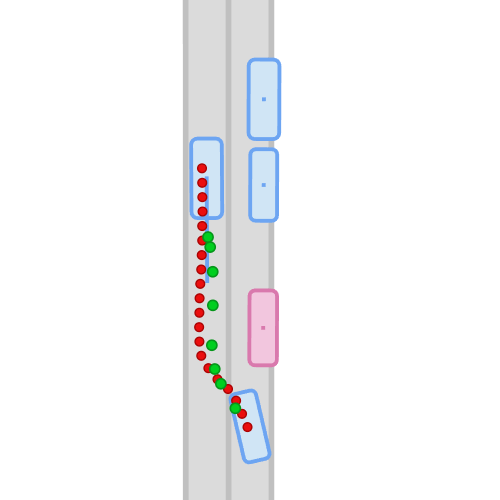
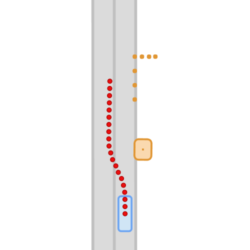
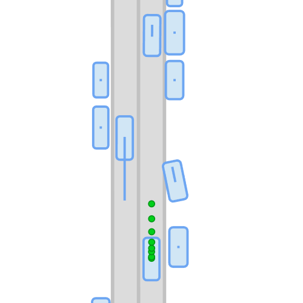

# PlanT 2.0: Exposing Biases and Structural Flaws in Closed-Loop Driving
PlanT 2.0 is a lightweight, object-centric planning transformer for CARLA that enables controlled analysis of failure modes while achieving strong closed-loop performance on CARLA Leaderboard 2.0 benchmarks.
<p align="center">
  <h3 align="center">
    <a href="https://simonger.github.io/plant2/">Project Page</a> | 
    <a href="https://arxiv.org/abs/2511.07292">Paper</a> | 
    <a href="https://huggingface.co/datasets/SimonGer/PlanT2_Dataset">Dataset</a> | 
    <a href="https://huggingface.co/SimonGer/PlanT2">Model</a>
  </h3>
</p>

<p align="center">
  
  
  
</p>

## Highlights
- Object-centric input representation that can be perturbed for systematic analysis.
- Upgrades for CARLA Leaderboard 2.0 scenarios.
- State-of-the-art results on Longest6 v2, Bench2Drive, and CARLA validation routes.
- Open-sourced code, models, and dataset for reproducibility.

## Contents
- [Installation](#installation)
- [Quick start inference](#quick-start-inference)
- [Evaluation at scale](#evaluation-at-scale)
- [Training](#training)
- [Dataset](#dataset)
- [Project structure](#project-structure)
- [Citation](#citation)
- [Acknowledgments](#acknowledgments)

## Installation
```bash
# 1. Clone this repository
git clone https://github.com/autonomousvision/plant2.git
cd plant2

# 2. Setup CARLA (skip if you already have a compatible install)
chmod +x setup_carla.sh
./setup_carla.sh

# 3. Setup environment
conda env create -f environment.yml
conda activate plant2
```

## Quick start inference
You can test the performance of the pretrained models using the CARLA leaderboard evaluator.

Set the environment variables:
```bash
export CARLA_ROOT=/path/to/CARLA
export WORK_DIR=/path/to/plant2
export SCENARIO_RUNNER_ROOT=$WORK_DIR/scenario_runner_autopilot
export LEADERBOARD_ROOT=$WORK_DIR/leaderboard_autopilot
export PYTHONPATH=$CARLA_ROOT/PythonAPI/carla:$LEADERBOARD_ROOT:$SCENARIO_RUNNER_ROOT:$WORK_DIR/PlanT:$WORK_DIR/carla_garage

# Required by PlanT/PlanT_agent.py
export PLANT_CHECKPOINT=/path/to/checkpoint.ckpt
export PLANT_VIZ=/path/to/viz_outputs  # set to empty string to disable
```

Then start CARLA and run the evaluator:
```bash
# Terminal 1
$CARLA_ROOT/CarlaUE4.sh

# Terminal 2
python leaderboard_autopilot/leaderboard/leaderboard_evaluator_local.py \
  --routes=/path/to/route_file.xml \
  --track=[SENSORS if B2D else MAP] \
  --agent=PlanT/PlanT_agent.py \
  --checkpoint=results.json \
  --timeout=300
```

## Evaluation at scale
For SLURM-based evaluation of a benchmark, use `PlanT/plant_evaluate.py`. It generates per-route job scripts and handles retries.

Before running:
- Update the `cfg` block inside `PlanT/plant_evaluate.py` with your local paths and CARLA settings.
- Adjust `PlanT/eval_num_jobs.txt` to control the maximum parallel jobs.

Example:
```bash
python PlanT/plant_evaluate.py \
  --checkpoint /path/to/epoch=029_final_1.ckpt \
  --routes /path/to/longest6_split/ \
  --out_root results/longest6 \
  --seeds 1 2 3
```

## Training
Training uses Hydra configs plus a few environment variables.

1) Create a user config:
- Copy `PlanT/config/user/simon.yaml` to `PlanT/config/user/<your_name>.yaml`.
- Update `working_dir` to your local checkout.

2) Update `PlanT/config/config.yaml`:
- Replace `TODO_your_username` with your user file name.

3) Set required env vars and start training:
```bash
export SEED=1
export DS=/path/to/plant_dataset   # folder that contains a `data/` subdir
export DS_LOCAL=/path/to/fast_cache # optional, for diskcache
export CHECKPOINT_ADDON=run1        # optional

python PlanT/lit_train.py
```

For SLURM, `PlanT/train_plant.sh` shows an example job script. It is cluster-specific and expects a local dataset cache, so adapt the paths and SLURM settings to your environment.

## Dataset
The dataset used in the paper is available on Hugging Face: https://huggingface.co/datasets/SimonGer/PlanT2_Dataset.

To collect your own dataset:
- Use the modified `carla_garage/autopilot.py` and `carla_garage/data_agent.py`.
- Run the SLURM helpers in `collect_dataset_slurm.py` or `0_run_collect_dataset_slurm.sh` (both are cluster-specific and require path/partition updates).
- Control parallel job limits via `max_num_jobs.txt`.
- The default collection settings do not require GPUs and collect object-level data only (no RGB).

## Project structure
- `PlanT/` core model, agent, configs, and training code.
- `carla_garage/` data collection agents and utilities.
- `leaderboard_autopilot/` and `scenario_runner_autopilot/` CARLA Leaderboard 2.0 forks used for evaluation.
- `Bench2Drive/` assets and scripts for Bench2Drive evaluation.

## Citation
```latex
@misc{gerstenecker2025plant20exposingbiases,
      title={PlanT 2.0: Exposing Biases and Structural Flaws in Closed-Loop Driving},
      author={Simon Gerstenecker and Andreas Geiger and Katrin Renz},
      year={2025},
      eprint={2511.07292},
      archivePrefix={arXiv},
      primaryClass={cs.RO},
      url={https://arxiv.org/abs/2511.07292},
}
```

## Acknowledgments
This repository builds upon the work of [`carla_garage`](https://github.com/autonomousvision/carla_garage) and [`PlanT`](https://github.com/autonomousvision/plant). We thank the authors for open-sourcing their work.
